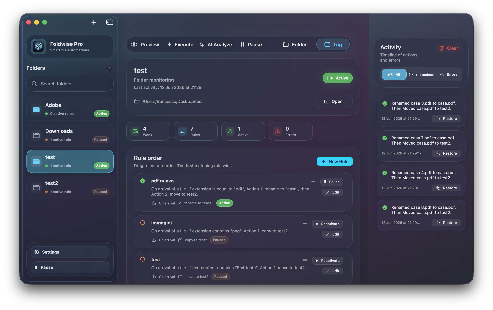

  

<h1 align="center">Foldwise</h1>

  <strong>Your Mac, automatically organized.</strong> 
  A native file organizer for macOS that keeps your workspace clean with smart rules, local intelligence, and calm automation.

  <a href="https://foldwise.pro"><strong>Official Website</strong></a>
  ·
  <a href="https://github.com/frafra077/Foldwise/releases/latest">Download</a>
  ·
  <a href="https://dodo.pe/foldwise">Foldwise Pro</a>

  
  
  

  

## Organize less. Get more done.

Foldwise is the Mac app that quietly takes care of file clutter for you.

It watches the folders you choose, applies your rules automatically, and helps you keep Downloads, Desktop, invoices, screenshots, client files, archives, and creative assets exactly where they belong. No manual sorting. No repeated cleanup. No clutter creeping back every day.

## What’s New in 1.1.0

### Create with AI (Beta)
Build rules by simply describing what you want in natural language.

Instead of clicking through every field manually, just write something like:

> “Move all PDFs with ‘invoice’ in the name to Documents/Invoices.”

Foldwise will generate the rule for you automatically.

This feature runs locally on your Mac using Apple’s **Foundation Models** framework, so your data stays private and nothing is sent to the cloud.

> ⚠️ **Beta:** this feature is still evolving and may occasionally make mistakes, especially with complex or ambiguous requests. Always review the generated rule before enabling it.

### Menu Bar Log Toggle
A new **Log** button in the menu bar makes it easy to show or hide the log section instantly, without interrupting your workflow.

### Other Improvements
- Improved English translation.
- Improved French translation.
- Stability, polish, and usability improvements across the app.

## Why Foldwise Feels Different

Most file tools make you work around them. Foldwise is designed to stay out of the way.

It gives you control where it matters, visibility where it helps, and automation where it saves time. You can preview actions, review what happened in the log, and undo supported operations when needed. It’s built to feel fast, calm, and trustworthy — like a good Mac app should.

## Highlights

| Feature | What It Does |
| --- | --- |
| **Real-time monitoring** | Watches selected folders and reacts when new files arrive. |
| **Smart rules** | Filters files by type, extension, name, text content, size, age, or creation date. |
| **Scheduled cleanup** | Runs rules on existing files at a daily time you choose. |
| **Safe preview** | Shows planned matches and actions before running rules manually. |
| **Action history** | Keeps a clear log for completed actions, previews, errors, and monitoring events. |
| **Undo support** | Reverses supported operations such as moves, copies, and Finder tags. |
| **Local suggestions** | Analyzes folders and proposes useful automations from real file patterns. |
| **Create with AI** | Builds rules from natural language, locally on device. |
| **Menu bar control** | Lets you pause, resume, inspect, and run automations without opening the main window. |

## Built for Real Mac Work

Foldwise is especially useful for:

- Keeping Downloads under control.
- Organizing screenshots automatically.
- Sorting invoices, documents, and work files by name or content.
- Grouping images, videos, archives, audio, and documents without manual sorting.
- Applying Finder tags as part of a repeatable workflow.
- Running cleanup routines on existing files with a single click.
- Creating rules faster when you don’t want to build them manually.

## Privacy First

Foldwise is built around local control and trust:

- Your files stay on your Mac.
- Rules are stored locally.
- Folder access follows macOS security permissions.
- Local analysis does not require uploading your documents.
- The AI creation feature runs on-device through Apple Foundation Models.
- Cleanup actions use the Trash instead of permanent deletion when removing files.

Internet access may be used for product features such as licensing, downloads, and app updates.

## Free and Pro

Foldwise is available as a freemium app.

**Foldwise Free** is ideal for getting started:

- 1 monitored folder.
- Up to 3 rules per folder.
- Essential actions such as move and trash.

**Foldwise Pro** unlocks the full experience for bigger, more advanced workflows, including more folders, more rules, advanced actions, app protection, startup behavior, and a more flexible daily automation setup.

## Requirements

- macOS 14 or later.
- A Mac compatible with recent macOS releases.

Some advanced capabilities may depend on the macOS version available on your device. The AI creation feature requires Apple Intelligence support.

## Website

Learn more, download the app, and explore Foldwise Pro at [foldwise.pro](https://foldwise.pro).

## Status

Foldwise is in active development, with a focus on polish, reliability, privacy, and a native macOS experience that feels fast, calm, and trustworthy.
