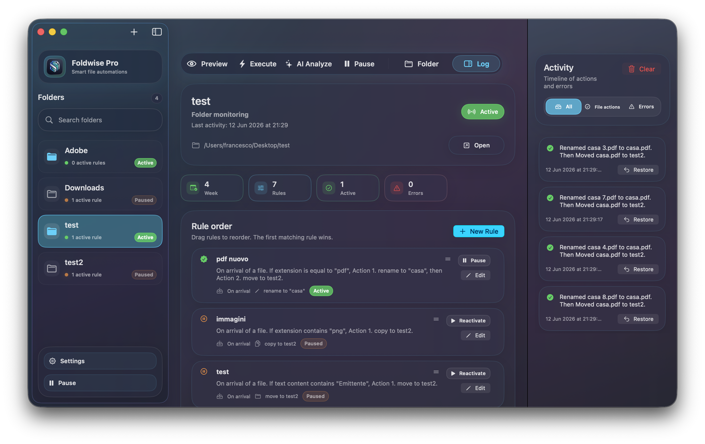

  

<h1 align="center">Foldwise</h1>

  <strong>Your Mac, automatically organized.</strong> 
  A native file organizer for macOS that keeps your workspace clean with smart rules, local intelligence, and calm automation.

  <a href="https://foldwise.pro"><strong>Official Website</strong></a>
  ·
  <a href="https://github.com/frafra077/Foldwise/releases/latest">Download</a>
  ·
  <a href="https://dodo.pe/foldwise">Foldwise Pro</a>

  
  
  

  

## Organize less. Get more done.

Foldwise is the Mac app that quietly takes care of file clutter for you.

It watches the folders you choose, applies your rules automatically, and helps you keep Downloads, Desktop, invoices, screenshots, client files, archives, and creative assets exactly where they belong. No manual sorting. No repeated cleanup. No clutter creeping back every day.

## What’s New in 1.1.1

### macOS 27 and On-Device Intelligence

Create with AI now uses the local model’s reasoning capabilities on macOS 27 when supported, helping it interpret natural-language requests. AI processing stays on your Mac without uploading your files to a cloud service.

### More Precise Rule Creation

Describe the files you want to select and what should happen to them:

> “Move PDFs larger than 2 MB and smaller than 10 MB into Work.”

> “Move PDFs into Archive, except those modified today.”

Foldwise prepares an editable draft for you to review before saving. This update improves handling of multiple conditions, exclusions, and action sequences. It checks for missing or changed file size thresholds and better distinguishes file criteria from execution times.

When a request needs more detail — such as “trash old PDFs” — Foldwise asks for a more precise threshold rather than guessing what “old” means.

### Local Visual Analysis

On macOS 27, when the local model supports images, folder suggestions can also consider a small sample of local image previews. Visual observations help inform suggestions; they do not automatically become rules based on image content.

If the model is unavailable, the compatible local engine remains available with more limited language understanding.

> ⚠️ **Beta:** Create with AI is a Pro feature and may still make mistakes. Always review the generated draft before enabling the rule.

## Previous Update: 1.1.0

- **Create with AI (Beta):** introduced natural-language rule creation, with a draft to review before saving.
- **Menu Bar Log Toggle:** added a Log button to quickly show or hide the log section.
- **Localization:** improved English and French translations.
- **General improvements:** refinements to stability, usability, and the interface.

## Why Foldwise Feels Different

Most file tools make you work around them. Foldwise is designed to stay out of the way.

It gives you control where it matters, visibility where it helps, and automation where it saves time. You can preview actions, review what happened in the log, and undo supported operations when needed. It’s built to feel fast, calm, and trustworthy — like a good Mac app should.

## Highlights

| Feature | What It Does |
| --- | --- |
| **Real-time monitoring** | Watches selected folders and reacts when new files arrive. |
| **Smart rules** | Filters files by type, extension, name, readable text content, size, age, creation date, or modification date. |
| **Scheduled cleanup** | Runs rules on existing files at a daily time you choose. |
| **Safe preview** | Shows planned matches and actions before running rules manually. |
| **Action history** | Keeps a clear log for completed actions, previews, errors, and monitoring events. |
| **Undo support** | Reverses supported operations such as moves, copies, and Finder tags. |
| **Local suggestions** | Proposes automations from file patterns, with sampled image previews on supported macOS 27 systems. |
| **Create with AI (Beta, Pro)** | Turns natural-language requests into editable rule drafts, with local processing and checks for missing details. |
| **Menu bar control** | Lets you pause, resume, inspect, and run automations without opening the main window. |

## Built for Real Mac Work

Foldwise is especially useful for:

- Keeping Downloads under control.
- Organizing screenshots automatically.
- Sorting invoices, documents, and work files by name or content.
- Grouping images, videos, archives, audio, and documents without manual sorting.
- Applying Finder tags as part of a repeatable workflow.
- Running cleanup routines on existing files with a single click.
- Creating rules faster when you don’t want to build them manually.

## Privacy First

Foldwise is built around local control and trust:

- Your files stay on your Mac.
- Rules are stored locally.
- Folder access follows macOS security permissions.
- Local analysis does not require uploading your documents.
- AI processing uses Apple Foundation Models on supported Macs, with a compatible local engine when the model is unavailable.
- Cleanup actions use the Trash instead of permanent deletion when removing files.

Internet access may be used for product features such as licensing, downloads, and app updates.

## Free and Pro

Foldwise is available as a freemium app.

**Foldwise Free** is ideal for getting started:

- 1 monitored folder.
- Up to 3 rules per folder.
- Essential actions such as move and trash.

**Foldwise Pro** unlocks the full experience for bigger, more advanced workflows, including unlimited folders and rules, Create with AI (Beta), local AI suggestions, advanced actions, app protection, and startup behavior.

## Requirements

- **Core app:** macOS 14 or later.
- **Foundation Models features:** macOS 26 or later on an Apple Intelligence-compatible Mac, with Apple Intelligence enabled and the local model ready.
- **Enhanced reasoning and visual analysis:** macOS 27, with the corresponding capabilities available in the local model.
- **Compatible mode:** a local interpreter remains available when Foundation Models is unavailable, with more limited language understanding.

Create with AI is included in Foldwise Pro. You do not need macOS 27 to use the core file organization features.

## Website

Learn more, download the app, and explore Foldwise Pro at [foldwise.pro](https://foldwise.pro).

## Status

Foldwise is in active development, with a focus on polish, reliability, privacy, and a native macOS experience that feels fast, calm, and trustworthy.
